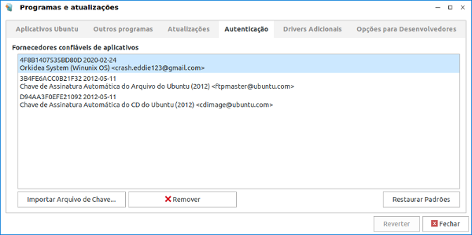
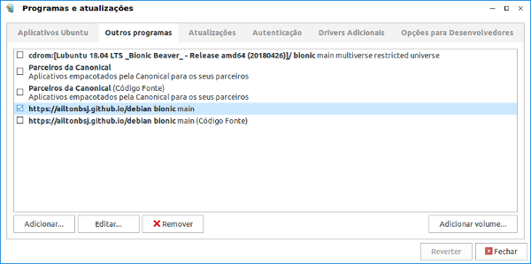

# Repositório Debian para sistemas baseados no Ubuntu 18.04 LTS

Apps para Linux Bionic Beaver.

## Como instalar via Terminal

Adicione a chave:
```bash
wget -qO - "https://winunix.github.io/debian/public.key" | sudo apt-key add -
```

Adicione o repositório:
```bash
echo "deb https://winunix.github.io/debian bionic main" | sudo tee /etc/apt/sources.list.d/winunix-bionic.list
sudo apt update
```

Caso for instalar algum programa `Wine`, primeiro execute os comandos:

```bash
sudo apt update
sudo apt install --install-recommends wine64
wine start hostname
```
Para uma instalação completa do `Wine` [acesse o link aqui!](https://ailtonbsj.github.io/running-windows-apps-on-linux-with-wine).


Caso for instalar algum programa `i386` em um sistema `amd64`, primeiro execute os comandos:

```bash
sudo dpkg --add-architecture i386
sudo apt update
```

## Como instalar graficamente

- Faça download da chave [public.key](https://winunix.github.io/debian/public.key). Adicione a chave no APT com o aplicativo `software-properties-gtk`, `software-properties-qt` ou similar.



- Adicione o repositório com o mesmo software:
```
deb https://winunix.github.io/debian bionic main
```




# Lista de Apps Bionic Beaver

#### Apps

- [crede-reservation](http://ailtonbsj.herokuapp.com/crede-reservation/) | amd64 | i386 | Exclusivo para CREDE17 |
- [credenews](http://ailtonbsj.herokuapp.com/credenews/) | amd64 | i386 |
- [flashplayer-sa-projector](https://github.com/ailtonbsj/flashplayer-sa-projector) | amd64 |
- [proxy-linux](https://github.com/winunix/proxy-linux) | amd64 | i386 |
- [seplag-guardiao-legado](#) | amd64 | Exclusivo para CREDEs/SEDUC-CE |
- [winunix-randr](https://github.com/winunix/winunix-randr) | amd64 | i386 |
- [wps-office-full](#) | amd64 | i386 |
- [zotero](https://github.com/retorquere/zotero-deb) | amd64 |

#### Educacionais

- [algodoo-wine](https://github.com/appsedu/algodoo-wine) | amd64 | i386 |
- [arduino-ide](https://github.com/appsedu/arduino-ide) | amd64 |
- [brmodelo](https://github.com/ailtonbsj/brModelo) | amd64 | i386 |
- [chemsketch-acd-wine](https://github.com/appsedu/chemsketch-acd-wine) | amd64 | i386 |
- [circuit-simulator](https://github.com/appsedu/circuit-simulator-bionic) | amd64 | i386 |
- [celestia-bionic](https://github.com/appsedu/celestia-bionic) | i386 |
- [geogebra-classic](https://wiki.geogebra.org/en/Reference:GeoGebra_Installation#GeoGebra_Classic_6) | amd64 |
- [goldendict-extras-pt](https://github.com/appsedu/goldendict-extras-pt) | amd64 | i386 |
- [google-earth-pro-stable](https://www.google.com.br/intl/pt-BR_ALL/earth/versions/) | amd64 |
- [gresistor-extras-pt](https://github.com/appsedu/gresistor-extras-pt) | amd64 | i386 |
- [irydium-chemistry-lab](https://github.com/appsedu/irydium-chemistry-lab) | amd64 | i386 |
- [optgeo-i18n](https://github.com/appsedu/optgeo-i18n) | amd64 | i386 |
- [physion-wine](https://github.com/appsedu/physion-wine) | amd64 | i386 |
- [simulide](https://github.com/appsedu/simulide-bionic) | amd64 |

#### Jogos e Emuladores de console

- [bsnes-nightly](https://github.com/ailtonbsj/bsnes-nightly-deb) | amd64 |

#### Ferramentas e Utilitários

- [fonts-3rd-party](#) | amd64 | i386 |
- [lubuntu-win10-icon-theme](https://github.com/winunix/lubuntu-win10-icon-theme) | amd64 | i386 |
- [lubuntu-win10-taskbar](https://github.com/winunix/lubuntu-win10-taskbar) | amd64 | i386 |
- [lubuntu-win10-theme](https://github.com/winunix/lubuntu-win10-theme) | amd64 | i386 |
- [lubuntu-win8-cursor-theme](https://github.com/winunix/lubuntu-win8-cursor-theme) | amd64 | i386 |
- [pcmanfm-thumbnailer](#) | amd64 | i386 |
- [wps-office-dicts-pt](https://github.com/winunix/wps-office-dicts-pt) | amd64 | i386 |
- [wps-office-fonts](https://github.com/winunix/wps-office-fonts) | amd64 | i386 |
- [wps-office-mui-pt](https://github.com/winunix/wps-office-mui-pt) | amd64 | i386 |
- [wps-office-templates](https://github.com/winunix/wps-office-templates) | amd64 | i386 |

#### Libs

- [libpng12-0](#) | i386 |
- [wps-office-addons](#) | amd64 | i386 |
- [wps-office-core](#) | amd64 | i386 |
