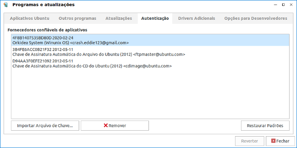
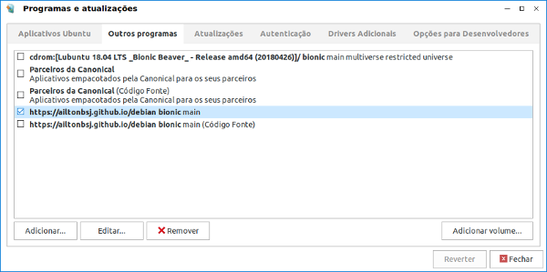

# Repositório Debian para sistemas baseados no Ubuntu 20.04 LTS

Apps para Linux Focal Fossa.

## Como instalar via Terminal

Adicione a chave:
```bash
wget -qO - "https://winunix.github.io/debian/public.key" | sudo tee /etc/apt/trusted.gpg.d/winunix.asc
```

Adicione o repositório:
```bash
echo "deb https://winunix.github.io/debian focal main" | sudo tee /etc/apt/sources.list.d/winunix-focal.list
sudo apt update
```

Caso for instalar algum programa `Wine`, primeiro execute os comandos:

```bash
sudo apt update
sudo apt install --install-recommends wine64
wine start hostname
```
Para uma instalação completa do `Wine` [acesse o link aqui!](https://ailtonbsj.github.io/running-windows-apps-on-linux-with-wine).


Caso for instalar algum programa `i386` em um sistema `amd64`, primeiro execute os comandos:

```bash
sudo dpkg --add-architecture i386
sudo apt update
```

## Como instalar graficamente

- Faça download da chave [public.key](https://winunix.github.io/debian/public.key). Adicione a chave no APT com o aplicativo `software-properties-gtk`, `software-properties-qt` ou similar.



- Adicione o repositório com o mesmo software:
```
deb https://winunix.github.io/debian focal main
```




# Lista de Apps Focal Fossa

#### Apps

- [aafm](https://github.com/sole/aafm) | amd64 | i386 |
- [crede-reservation](http://ailtonbsj.herokuapp.com/crede-reservation/) | amd64 | i386 | Exclusivo para CREDE17 |
- [credenews](http://ailtonbsj.herokuapp.com/credenews/) | amd64 | i386 |
- [flashplayer-sa-projector](https://github.com/ailtonbsj/flashplayer-sa-projector) | amd64 |
- [mgba-qt](#) | amd64 |
- [orkidea-stockcontrol](https://github.com/ailtonbsj/stockcontrol) | amd64 | i386 |
- [proxy-linux](https://github.com/winunix/proxy-linux) | amd64 | i386 |
- [seplag-guardiao-legado](#) | amd64 | Exclusivo para CREDEs/SEDUC-CE |
- [system-config-samba-focal](https://github.com/winunix/system-config-samba-focal) | amd64 | i386 |
- [unetbootin-focal](https://github.com/winunix/unetbootin-focal) | amd64 |
- [winunix-anbox-installer](#) | amd64 | i386 |
- [woeusb](https://github.com/slacka/WoeUSB) | amd64 | i386 |
- [wps-office-full](#) | amd64 |
- [xampp](https://www.apachefriends.org/pt_br/index.html) | amd64 | i386 |
- [zotero](https://github.com/retorquere/zotero-deb) | amd64 |

#### Educacionais

- [appsedu](https://github.com/appsedu/appsedu-menus) | amd64 | i386 |
- [appsedu-menus](https://github.com/appsedu/appsedu-menus) | amd64 | i386 |
- [algodoo-wine](https://github.com/appsedu/algodoo-wine) | amd64 | i386 |
- [arduino-ide](https://github.com/appsedu/arduino-ide) | amd64 |
- [astah-community](https://github.com/winunix/debian/tree/master/pool/main/a/astah-community) | amd64 | i386 |
- [brmodelo](https://github.com/ailtonbsj/brModelo) | amd64 | i386 |
- [camotics](https://camotics.org) | amd64 | i386 |
- [celestia](https://celestia.space) | amd64 |
- [chemsketch-acd-wine](https://github.com/appsedu/chemsketch-acd-wine) | amd64 | i386 |
- [circuit-simulator](https://github.com/appsedu/circuit-simulator-bionic) | amd64 | i386 |
- [coppelia-sim-edu](https://github.com/appsedu/coppelia-sim-edu) | amd64 | i386 |
- [digital-simulator](https://github.com/hneemann/Digital) | amd64 | i386 |
- [elements](https://github.com/FlorianFe/Elements) | amd64 |
- [energy2d](https://energy.concord.org/energy2d) | amd64 | i386 |
- [free-cnc-simulator-wine](http://cncsimulator.info/) | amd64 | i386 |
- [gcad3d](http://www.gcad3d.org/) | amd64 | i386 |
- [geogebra-classic](https://wiki.geogebra.org/en/Reference:GeoGebra_Installation#GeoGebra_Classic_6) | amd64 |
- [goldendict-extras-pt](https://github.com/appsedu/goldendict-extras-pt) | amd64 | i386 |
- [google-cow](#) | amd64 | i386 |
- [google-earth-pro-stable](https://www.google.com.br/intl/pt-BR_ALL/earth/versions/) | amd64 |
- [gresistor-extras-pt](https://github.com/appsedu/gresistor-extras-pt) | amd64 | i386 |
- [hopsan](https://github.com/Hopsan/hopsan)| amd64 | i386 |
- [irydium-chemistry-lab](https://github.com/appsedu/irydium-chemistry-lab) | amd64 | i386 |
- [logisim-evolution](https://github.com/reds-heig/logisim-evolution) | amd64 | i386 |
- [openmeca](https://gitlab.com/damien.andre/openmeca) | amd64 |
- [optgeo-i18n](https://github.com/appsedu/optgeo-i18n) | amd64 | i386 |
- [physion-wine](https://github.com/appsedu/physion-wine) | amd64 | i386 |
- [simulide](https://github.com/appsedu/simulide-bionic) | amd64 |
- [virtual-lab-microscope](#) | amd64 | i386 |

#### Jogos e Emuladores de console

- [bsnes-nightly](https://github.com/ailtonbsj/bsnes-nightly-deb) | amd64 |

#### Ferramentas e Utilitários

- [fonts-3rd-party](#) | amd64 | i386 |
- [lubuntu-win-theme-apply](https://github.com/winunix/lubuntu-win-theme-apply) | amd64 | i386 |
- [lubuntu-win10-icon-theme](https://github.com/winunix/lubuntu-win10-icon-theme) | amd64 | i386 |
- [lubuntu-win10-qt-theme](https://github.com/winunix/lubuntu-win10-qt-theme) | amd64 | i386 |
- [lubuntu-win10-theme](https://github.com/winunix/lubuntu-win10-theme) | amd64 | i386 |
- [lubuntu-win8-cursor-theme](https://github.com/winunix/lubuntu-win8-cursor-theme) | amd64 | i386 |
- [pcmanfm-thumbnailer](#) | amd64 | i386 |
- [screen-tearing-intel-fix](#) | amd64 | i386 |
- [sddm-theme-win10](https://github.com/winunix/sddm-theme-win10) | amd64 | i386 |
- [wps-office-dicts-pt](https://github.com/winunix/wps-office-dicts-pt) | amd64 | i386 |
- [wps-office-fonts](https://github.com/winunix/wps-office-fonts) | amd64 | i386 |
- [wps-office-mui-pt](https://github.com/winunix/wps-office-mui-pt) | amd64 | i386 |
- [wps-office-templates](https://github.com/winunix/wps-office-templates) | amd64 | i386 |
- [wine-themes](#) | amd64 | i386 |

#### Libs

- [celestia-common](#) | amd64 | i386 |
- [celestia-gtk](#) | amd64 | i386 |
- [gresistor](#) | amd64 | i386 |
- [libdouble-conversion1](#) | amd64 |
- [libmgba](#) | amd64 |
- [libwxgtk3.0-0v5](#) | amd64 |
- [libv8-3.14.5](#) | amd64 |
- [mgba-sdl](#) | amd64 |
- [python-glade2](#) | amd64 |
- [python-gtk2](#) | amd64 |
- [python-libuser](#) | amd64 |
- [qt-at-spi](#) | amd64 |
- [wps-office-addons](#) | amd64 |
- [wps-office-core](#) | amd64 |

